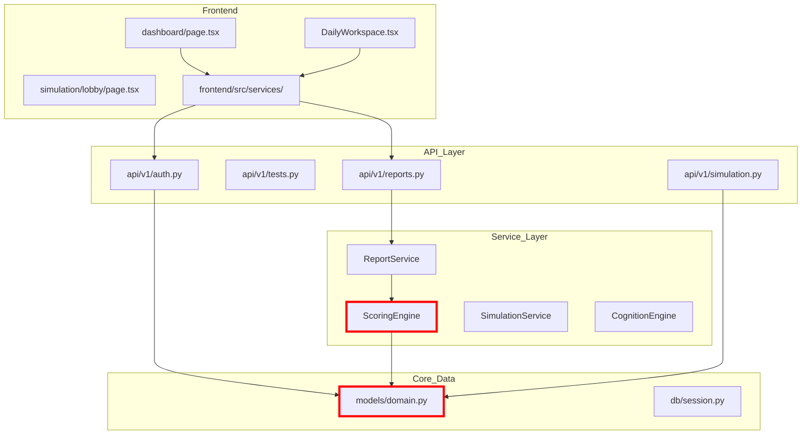

# ARCHITECTURE MAP

## LAYER DEFINITIONS

1.  **Core Data (L0)**: The frozen foundation. `models/domain.py`. Any mutation here has a global blast radius.
2.  **Service Layer (L1)**: Business logic and mathematical truth. `ScoringEngine` is the anchor.
3.  **API Layer (L2)**: RESTful entry points. Translates external requests into service calls.
4.  **Interface Layer (L3)**: The student-facing experience. Governed by the "Calm Student UX" philosophy.

## BLAST RADIUS ANALYSIS
*   **L0 Change**: Impacts ~110 files. Requires full system regression test.
*   **L1 Change**: Impacts all related APIs and Frontend reports.
*   **L2 Change**: Impacts specific frontend features.
*   **L3 Change**: Localized impact unless modifying shared components.
